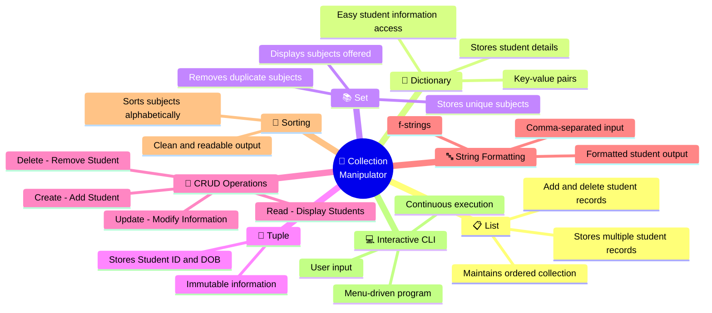
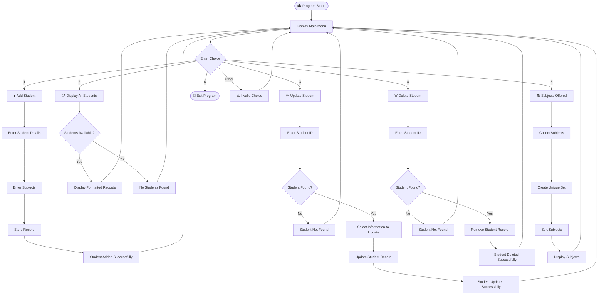

<div align="center">

🎓 Collection Manipulator

🚀 Student Data Organizer

A Beginner-Friendly Python Collection Management Application

🐍 Learn Python Collections the Practical Way! ✨

Python
Platform
Level
Status
License

</div>

────────

📖 Overview

<div align="center">

Collection Manipulator – Student Data Organizer is a beginner-friendly
🐍 Python console application designed to manage student records using
Python’s built-in collection data structures.

The application allows users to add, display, update, and delete student
records, while demonstrating the practical use of List, Dictionary,
Set, and Tuple.

This project shows how different Python collections can work together in a
real-world student data management system. 🎓

</div>

────────

✨ Features

|🎯 Feature               |📝 Description                               |🔧 Data Structure            |
|:-----------------------|:-------------------------------------------|:---------------------------|
|➕ **Add Student**       |Register a new student with complete details|List, Dictionary, Set, Tuple|
|📋 **Display Students**  |View all registered student records         |List, Dictionary            |
|✏️ **Update Information**|Modify name, age, grade, or subjects        |Dictionary, Set             |
|🗑️ **Delete Student**    |Remove a student record safely              |List, Dictionary            |
|📚 **Subjects Offered**  |Display all unique subjects                 |Set                         |
|💻 **Interactive CLI**   |Provides a simple command-line experience   |Python                      |

────────

🧩 Collection Data Structure Map

<div align="center">

|📦 Collection    |🔧 Purpose                                |💡 Example         |
|:--------------:|:----------------------------------------|:-----------------|
|📋 **List**      |Stores multiple student records          |`students = []`   |
|📖 **Dictionary**|Stores student details as key-value pairs|`student = {}`    |
|📚 **Set**       |Stores unique subjects                   |`subjects = set()`|
|🔗 **Tuple**     |Stores immutable student information     |`info = (id, dob)`|

</div>

────────

🔄 CRUD Operations

|🔤 Operation |⚙️ Function                         |
|:----------:|:----------------------------------|
|🟢 **Create**|Add a new student                  |
|🔵 **Read**  |Display student records            |
|🟡 **Update**|Modify existing student information|
|🔴 **Delete**|Remove student records             |

────────

🧠 Concepts Used

<div align="center">

🐍 Python Collection Concepts

</div>



📊 Concept & Purpose Map

<div align="center">

|🧩 Concept          |🎯 Purpose in This Project                      |
|:------------------|:----------------------------------------------|
|📋 `List`           |Maintains multiple student records             |
|📖 `Dictionary`     |Stores student details using key-value pairs   |
|📚 `Set`            |Keeps subjects unique and removes duplicates   |
|🔗 `Tuple`          |Stores immutable Student ID and DOB information|
|🔄 CRUD             |Adds, displays, updates, and deletes records   |
|🔤 String Formatting|Creates clean and user-friendly output         |
|🔢 Sorting          |Displays subjects in alphabetical order        |
|💻 CLI              |Provides an interactive command-line interface |

</div>

────────

🔄 Application Flowchart



────────

⚙️ How It Works

1️⃣ Add Student

The user enters:

• Student ID
• Name
• Age
• Grade
• Date of Birth
• Subjects

The information is stored using appropriate Python collection types.

2️⃣ Display All Students

The program displays all registered students with their ID, name, age,
grade, date of birth, and subjects.

Subjects are sorted before displaying them for cleaner output.

3️⃣ Update Student

The user can update one or multiple fields:

```text
1. Update Name
2. Update Age
3. Update Grade
4. Update Subjects
```

4️⃣ Delete Student

The user provides the Student ID and the corresponding record is removed.

5️⃣ Display Subjects Offered

All subjects from student records are combined into a Set, so duplicate
subjects are removed automatically.

────────

💻 Sample Output

```text
Welcome to Student Data Organizer!

===== Student Data Organizer =====
1. Add Student
2. Display All Students
3. Update Student Information
4. Delete Student
5. Display Subjects Offered
6. Exit

Enter your choice: 1

--- Add Student ---

Enter Student ID: 01
Name: khushi
Age: 20
Grade: A
Date of Birth (YYYY-MM-DD): 2006-02-22
Enter Subjects (comma-separated): maths,ai,java,python

Student added successfully!
```

📋 Display Students

```text
--- All Students ---

ID: 1 | Name: khushi | Age: 20 | Grade: A
DOB: 2006-02-22 | Subjects: ai, java, maths, python

ID: 2 | Name: neepa | Age: 19 | Grade: B
DOB: 2007-05-25 | Subjects: ai, bio, hindi, java
```

✏️ Update Student

```text
--- Update Student ---

Enter Student ID: 02

1. Update Name
2. Update Age
3. Update Grade
4. Update Subjects

Enter your choices: 1,4

Enter new name: maitri
Enter new subjects:
hindi,gujarati,social science,maths

Student updated successfully!
```

🗑️ Delete Student

```text
--- Delete Student ---

Enter Student ID: 01

Student ID 1 deleted successfully!
```

📚 Subjects Offered

```text
--- Subjects Offered ---

Unique Subjects Offered:
- gujarati
- hindi
- maths
- social science
```

🚪 Exit

```text
Thank you for using Student Data Organizer!
Exiting the program. Goodbye!
```

────────

🛠️ Requirements

<div align="center">

|🧩 Requirement           |📌 Details                              |
|:-----------------------|:--------------------------------------|
|🐍 **Python**            |Version 3.x or higher                  |
|💻 **Terminal**          |Command Prompt, PowerShell, or Terminal|
|📦 **External Libraries**|None required                          |

</div>

────────

📁 Project Files

<div align="center">

|📄 File             |📝 Description                                     |
|:------------------|:-------------------------------------------------|
|🐍 `pr3.py`         |Main Python source code for Student Data Organizer|
|📖 `README.md`      |Project documentation                             |
|🎬 `assets/demo.gif`|Optional project demonstration                    |

</div>

────────

🧠 Technical Concepts

• 🐍 Python Programming
• 📋 List Manipulation
• 📖 Dictionary Manipulation
• 📚 Set Operations
• 🔗 Tuple Usage
• 🔤 String Formatting
• 🔄 Loops
• 🔀 Conditional Statements
• ⌨️ User Input
• 🔧 CRUD Operations
• 📊 Collection Management

---

# 💻 Output Screenshots

<div align="center">

### 🖥️ Program Execution Output


</div>

────────
---

# 🎥 Demo Video

<div align="center">

### ▶️ Watch the Project Demonstration

(https://github.com/user-attachments/assets/ed9370d5-aac1-44c8-b83f-0b05384d4507)

**Click the button above to watch the complete demonstration of the  
Student Data Organizer.**

</div>

💙 Thank You for Visiting!

Made with ❤️ using 🐍 Python

```text
╔═══════════════════════════════════════════════════════╗
║                                                       ║
║       🎓 Happy Coding! Keep Learning Python 🐍       ║
║                                                       ║
╚═══════════════════════════════════════════════════════╝
```

</div>
